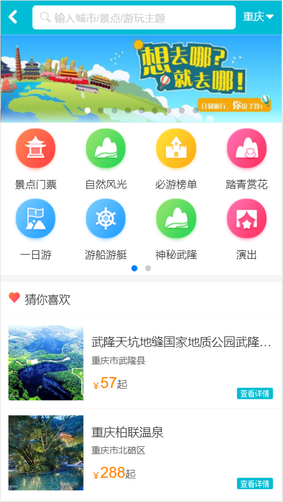
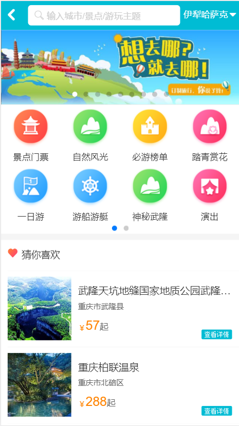
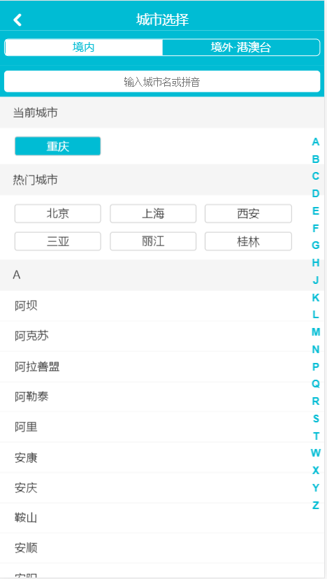
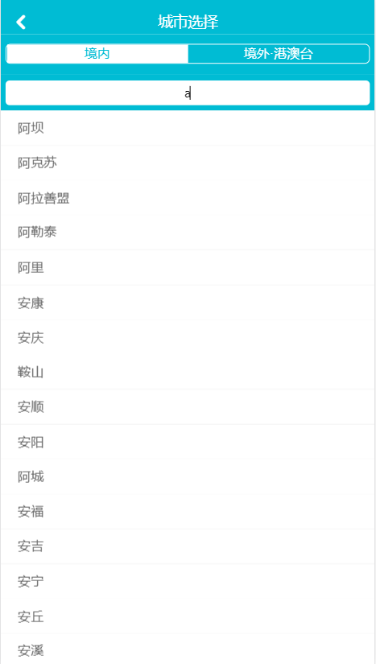
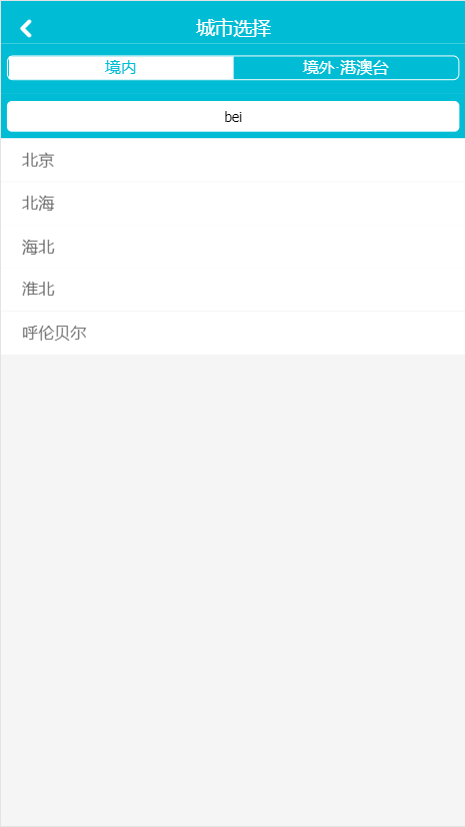
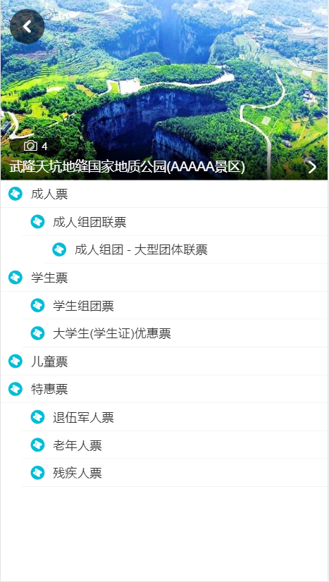
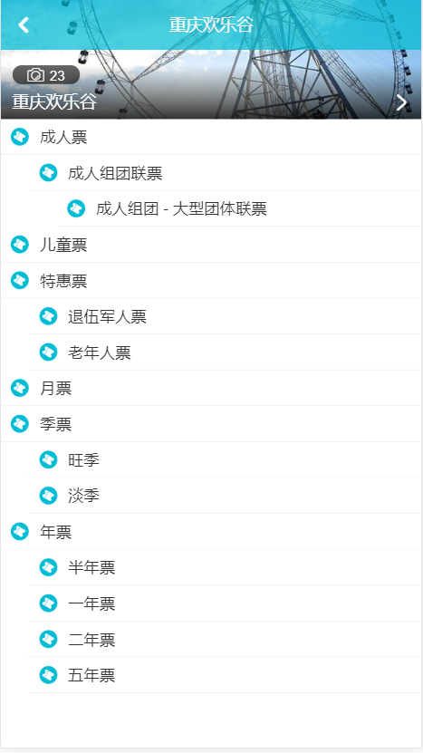

Vue2.x+webpack+vue-router+vuex 开发 去哪儿网WebApp
=======
# 去哪儿网 - WebApp

## <i class="icon-list"></i> 本页索引

* [快速运行](#快速运行)
* [环境参数](#环境参数)
* [应用图示及介绍](#应用图示及介绍)

## 快速运行

> https://github.com/vernonn/qunar-app

立即查看运行:

- 在github上下载并解压此项目 或 将此项目clone你选择的路径下。
- 在项目的根目录下，执行 `npm install` 下载项目依赖（可打开package.JSON文件查看所需模块）。
- 同样，在项目的根目录下，执行 `npm run start`，在网址栏输入`http://localhost:8080/`。
- 在电脑端，项目WebApp打开后，请检查元素(F12)后再刷新查看。
- 提示：如npm下载依赖速度过慢，请使用淘宝NPM镜像。

## 环境参数
- 技术语言
    - HTML
    - SASS/SCSS
    - ES6
- 框架
    - Vue.js 2.x
    - Vue Router 2.x
    - Vuex 2.x
- 环境配置
    - Node 8.11.1
    - NPM 5.6.0

## 应用图示及介绍

- 去哪儿 - 主界面

- [x] banner部分自动轮播
- [x] 图标选择栏左右拖动，共两页
- [x] “猜你喜欢”部分，点击不同的选项，根据动态路由进入到对应的景点门票详情页面

- 去哪儿 - 城市选择切换页面

- [x] 右侧可通过点击或触摸滑动字母，来查看首字母对应的城市
- [x] 点击选择城市后，主页面顶部栏右侧的城市显示改变为相应的城市
- [ ] 境内城市页面已完成，境外城市页面只显示尚无数据

- 去哪儿 - 城市搜索选择切换

- [x] 输入相应中文或字母，搜索显示页面显示出搜索到的城市列表
- [x] 点击选择城市后，主页面顶部栏右侧的城市显示改变为相应的城市

- 去哪儿 - 景区票价详情页面

